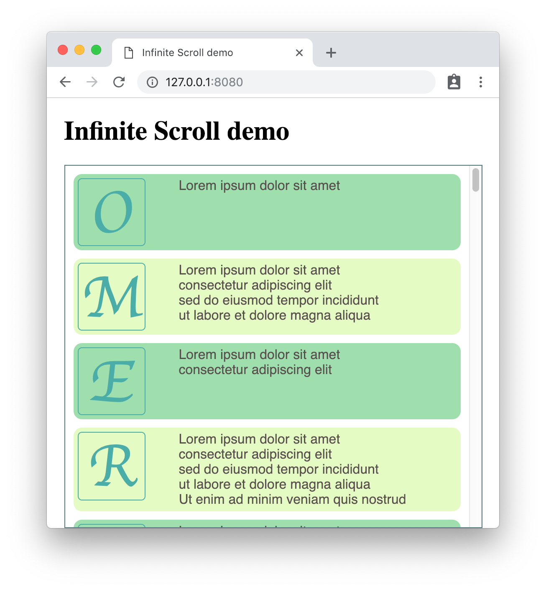

# scroll-demo
Infinite Scroll demo

# Live demo
https://vburlai.github.io/scroll-demo/



# Building the project

Install Yarn package manager from [here](https://yarnpkg.com/en/docs/install) (if not present)

## Install dependencies
```
yarn
```

## Start local dev server
```
yarn dev
```
It will start a webpack server at `0.0.0.0:8080` and will open the app in a browser.

It works best in the latest Chrome, Firefox, EDGE browsers.

## Building production version
```
yarn build
```

Will create production build and save it to `dst/` directory.
